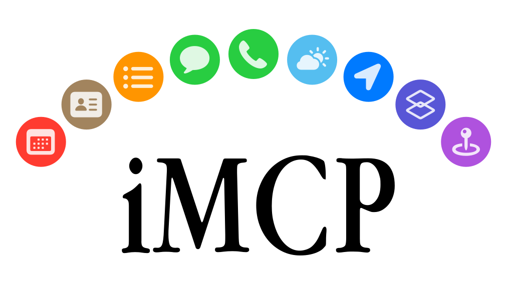

<picture>
  <source media="(prefers-color-scheme: dark)" srcset="Assets/hero-dark.svg">
  <source media="(prefers-color-scheme: light)" srcset="Assets/hero-light.svg">
  
</picture>

iMCP is a macOS app for connecting your digital life with AI.
It works with [Claude Desktop][claude-app]
and a [growing list of clients][mcp-clients] that support the
[Model Context Protocol (MCP)][mcp].

## Capabilities

<table>
  <tr>
    <th>
      
    </th>
    <td><strong>Calendar</strong></td>
    <td>View and manage calendar events, including creating new events with customizable settings like recurrence, alarms, and availability status.</td>
  </tr>
  <tr>
    <th>
      
    </th>
    <td><strong>Contacts</strong></td>
    <td>Access contact information about yourself and search your contacts by name, phone number, or email address.</td>
  </tr>
  <tr>
    <th>
      
    </th>
    <td><strong>Location</strong></td>
    <td>Access current location data and convert between addresses and geographic coordinates.</td>
  </tr>
  <tr>
    <th>
      
    </th>
    <td><strong>Maps</strong></td>
    <td>Provides location services including place search, directions, points of interest lookup, travel time estimation, and static map image generation.</td>
  </tr>
  <tr>
    <th>
      
    </th>
    <td><strong>Messages</strong></td>
    <td>Access message history with specific participants within customizable date ranges.</td>
  </tr>
  <tr>
    <th>
      
    </th>
    <td><strong>Phone</strong></td>
    <td>View call history synced from your iPhone, filter calls by participant, date, or call type, and start calls with system confirmation.</td>
  </tr>
  <tr>
    <th>
      
    </th>
    <td><strong>Reminders</strong></td>
    <td>View and create reminders with customizable due dates, priorities, and alerts across different reminder lists.</td>
  </tr>
  <tr>
    <th>
      
    </th>
    <td><strong>Shortcuts</strong></td>
    <td>List and run shortcuts on your Mac, with optional text input.</td>
  </tr>
  <tr>
    <th>
      
    </th>
    <td><strong>Weather</strong></td>
    <td>Access current weather conditions including temperature, wind speed, and weather conditions for any location.</td>
  </tr>
</table>

## Getting Started

### Download and open the app

First, [download the iMCP app](https://iMCP.app/download)
(requires macOS 15.3 or later).

Or, if you have [Homebrew](https://brew.sh) installed,
you can run the following command:

```console
brew install --cask mattt/tap/iMCP
```


When you open the app,
you'll see a

icon in your menu bar.

Clicking on this icon reveals the iMCP menu,
which displays all available services.
Initially, all services will appear in gray,
indicating they're inactive.

The blue toggle switch at the top indicates that the MCP server is running
and ready to connect with MCP-compatible clients.

<br clear="all">


### Activate services

To activate a service, click on its icon.
The system will prompt you with a permission dialog.
For example, when activating Calendar access, you'll see a dialog asking `"iMCP" Would Like Full Access to Your Calendar`.
Click <kbd>Allow Full Access</kbd> to continue.

> [!IMPORTANT]
> iMCP **does not** collect or store any of your data.
> Clients like Claude Desktop _do_ send
> your data off device as part of tool calls.

<br clear="all">


Once activated,
each service icons goes from gray to their distinctive colors —
red for Calendar, green for Messages, blue for Location, and so on.

Repeat this process for all of the capabilities you'd like to enable.
These permissions follow Apple's standard security model,
giving you complete control over what information iMCP can access.

<!-- <br clear="all"> -->

<!--  -->

<br clear="all">

### Connect to Claude Desktop

If you don't have Claude Desktop installed,
you can [download it here](https://claude.ai/download).

Open Claude Desktop and go to "Settings... (<kbd>⌘</kbd><kbd>,</kbd>)".
Click on "Developer" in the sidebar of the Settings pane,
and then click on "Edit Config".
This will create a configuration file at
`~/Library/Application Support/Claude/claude_desktop_config.json`.

<br/>

To connect iMCP to Claude Desktop,
click 
\> "Configure Claude Desktop".

This will add or update the MCP server configuration to use the
`imcp-server` executable bundled in the application.
Other MCP server configurations in the file will be preserved.

<details>
<summary>You can also configure Claude Desktop manually</summary>

Click 
\> "Copy server command to clipboard".
Then open `claude_desktop_config.json` in your editor
and enter the following:

```json
{
  "mcpServers": {
    "iMCP": {
      "command": "{paste iMCP server command}"
    }
  }
}
```

</details>


### Call iMCP tools from Claude Desktop

Quit and reopen the Claude Desktop app.
You'll be prompted to approve the connection.

<br clear="all">

After approving the connection,
you should now see 🔨12 in the bottom right corner of your chat box.
Click on that to see a list of all the tools made available to Claude
by iMCP.

<p align="center">
  
</p>

Now you can ask Claude questions that require access to your personal data,
such as:

> "How's the weather where I am?"

Claude will use the appropriate tools to retrieve this information,
providing you with accurate, personalized responses
without requiring you to manually share this data during your conversation.

<p align="center">
  
</p>

### Connect to [Claude Code][claude-code]

To add iMCP globally after installing the app:

```console
claude mcp add --scope user iMCP -- /Applications/iMCP.app/Contents/MacOS/imcp-server
```

<details>
<summary>Or import from Claude Desktop</summary>

If you've already configured Claude Desktop, you can import its MCP servers:

```console
claude mcp add-from-claude-desktop
```

</details>

### Connect to [Cursor][cursor]

Open this deep link to automatically install the iMCP server:

<a href="https://cursor.com/en-US/install-mcp?name=iMCP&config=eyJjb21tYW5kIjoiL0FwcGxpY2F0aW9ucy9pTUNQLmFwcC9Db250ZW50cy9NYWNPUy9pbWNwLXNlcnZlciAifQ%3D%3D">
  <picture>
    <source media="(prefers-color-scheme: dark)" srcset="https://cursor.com/deeplink/mcp-install-dark.svg">
    <source media="(prefers-color-scheme: light)" srcset="https://cursor.com/deeplink/mcp-install-light.svg">
    
  </picture>
</a>

### Connect to [Amp][amp]

To add iMCP globally (available in all projects):

```console
amp mcp add iMCP -- /Applications/iMCP.app/Contents/MacOS/imcp-server
```

> [!NOTE]
> When a client first connects, iMCP will show an approval dialog.
> Click "Allow" and check "Always trust this client" to avoid repeated prompts.

## Technical Details

### App & CLI

iMCP is a macOS app that bundles a command-line executable, `imcp-server`.

- [`iMCP.app`](/App/) provides UI for configuring services and — most importantly —
  a means of interacting with macOS system permissions,
  so that it can access Contacts, Calendar, and other information.
- [`imcp-server`](/CLI/) provides an MCP server that
  uses standard input/output for communication
  ([stdio transport][mcp-transports]).

The app and CLI communicate with each other on the local network
using [Bonjour][bonjour] for automatic discovery.
Both advertise a service with type "\_mcp.\_tcp" and domain "local".
Requests from MCP clients are read by the CLI from `stdin`
and relayed to the app;
responses from the app are received by the CLI and written to `stdout`.
See [`StdioProxy`](https://github.com/mattt/iMCP/blob/8cf9d250286288b06bf5d3dda78f5905ad0d7729/CLI/main.swift#L47)
for implementation details.

For this project, we created what became
[the official Swift SDK][swift-sdk]
for Model Context Protocol servers and clients.
The app uses this package to handle proxied requests from MCP clients.

### iMessage Database Access

Apple doesn't provide public APIs for accessing your messages.
However, the Messages app on macOS stores data in a SQLite database located at
`~/Library/Messages/chat.db`.

iMCP runs in [App Sandbox][app-sandbox],
which limits its access to user data and system resources.
When you go to enable the Messages service,
you'll be prompted to select your `~/Library/Messages` folder through the standard file picker.
When you do, macOS adds that folder to the app's sandbox.
[`NSOpenPanel`][nsopenpanel] is magic like that.
The folder matters: `chat.db` is a WAL-mode database,
and Messages writes every new message to `chat.db-wal` next to it first,
only folding the log into `chat.db` at a checkpoint every few MB —
often hours later.
A grant on `chat.db` alone (what earlier versions asked for)
leaves that log unreadable, so the newest messages were missing until then.
If you granted `chat.db` with an earlier version, Messages keeps working from the last checkpoint;
switch Messages off and on in the iMCP menu to grant the folder instead.

But opening the iMessage database is just half the battle.
Over the past few years,
Apple has moved away from storing messages in plain text
and instead toward a proprietary `typedstream` format.

For this project, we created [Madrid][madrid]:
a Swift package for reading your iMessage database.
It includes a Swift implementation for decoding Apple's `typedstream` format,
adapted from Christopher Sardegna's [imessage-exporter] project
and [blog post about reverse-engineering `typedstream`][typedstream-blog-post].

### Call History Database Access

Call history synced from your iPhone lives in a SQLite database at
`~/Library/Application Support/CallHistoryDB/CallHistory.storedata`.
Recent calls sit in its write-ahead log next to the store file,
so the Phone service asks you to open the `CallHistoryDB` folder
rather than the file alone.

### JSON-LD for Tool Results

The tools provided by iMCP return results as
[JSON-LD][json-ld] documents.
For example,
the `fetchContacts` tool uses the [Contacts framework][contacts-framework],
which represents people and organizations with the [`CNContact`][cncontact] type.
Here's how an object of that type is encoded as JSON-LD:

```json
{
  "@context": "https://schema.org",
  "@type": "Person",
  "name": "Mattt",
  "url": "https://mat.tt"
}
```

[Schema.org][schema.org] provides standard vocabularies for
people, postal addresses, events, and many other objects we want to represent.
And JSON-LD is a convenient encoding format for
humans, AI, and conventional software alike.

For this project, we created [Ontology][ontology]:
a Swift package for working with structured data.
It includes convenience initializers for types from Apple frameworks,
such as those returned by iMCP tools.

## Debugging

### Allowing local network access

`imcp-server` finds the iMCP app with Bonjour,
so it needs permission to access the local network.
`imcp-server` has its own entry in
System Settings > Privacy & Security > Local Network,
separate from iMCP and from the app that runs it, such as your terminal.
If that entry is turned off,
`imcp-server` can't find the app
and reports that Bonjour service discovery timed out.

### Using the MCP Inspector

To debug interactions between iMCP and clients,
you can use the [inspector tool](https://github.com/modelcontextprotocol/inspector)
(requires Node.js):

1. Click  > "Copy server command to clipboard"
2. Open a terminal and run the following commands:

   ```console
   # Download and run inspector package on imcp-server
   npx @modelcontextprotocol/inspector [paste-copied-command]

   # Open inspector web app running locally
   open http://127.0.0.1:6274
   ```

Inspector lets you see all requests and responses between the client and the iMCP server,
which is helpful for understanding how the protocol works.

### Using Companion


[Companion][companion] is a utility for testing and debugging your MCP servers
(requires macOS 15 or later).
It gives you an easy way to browse and interact with
a server's prompts, resources, and tools.
Here's how to connect it to iMCP:

1. Click  > "Copy server command to clipboard"
2. [Download][companion-download] and open the Companion app
3. Click the <kbd>+</kbd> button in the toolbar to add an MCP server
4. Fill out the form:
   - Enter "iMCP" as the name
   - Select "STDIO" as the transport
   - Paste the copied iMCP server command
   - Click "Add Server"

<br clear="all">

## Acknowledgments

- [Justin Spahr-Summers](https://jspahrsummers.com/)
  ([@jspahrsummers](https://github.com/jspahrsummers)),
  David Soria Parra
  ([@dsp-ant](https://github.com/dsp-ant)), and
  Ashwin Bhat
  ([@ashwin-ant](https://github.com/ashwin-ant))
  for their work on MCP.
- [Christopher Sardegna](https://chrissardegna.com)
  ([@ReagentX](https://github.com/ReagentX))
  for reverse-engineering the `typedstream` format
  used by the Messages app.

## License

This project is available under the MIT license.
See the LICENSE file for more info.

## Legal

iMessage® is a registered trademark of Apple Inc.
This project is not affiliated with, endorsed, or sponsored by Apple Inc.

[amp]: https://ampcode.com
[app-sandbox]: https://developer.apple.com/documentation/security/app-sandbox
[bonjour]: https://developer.apple.com/bonjour/
[claude-app]: https://claude.ai/download
[claude-code]: https://claude.com/product/claude-code
[companion]: https://github.com/mattt/Companion
[companion-download]: https://github.com/mattt/Companion/releases/latest/download/Companion.zip
[contacts-framework]: https://developer.apple.com/documentation/contacts
[cncontact]: https://developer.apple.com/documentation/contacts/cncontact
[cursor]: https://cursor.com
[imessage-exporter]: https://github.com/ReagentX/imessage-exporter
[json-ld]: https://json-ld.org
[madrid]: https://github.com/mattt/Madrid
[mcp]: https://modelcontextprotocol.io/introduction
[mcp-clients]: https://modelcontextprotocol.io/clients
[mcp-transports]: https://modelcontextprotocol.io/docs/concepts/architecture#transport-layer
[nsopenpanel]: https://developer.apple.com/documentation/appkit/nsopenpanel
[ontology]: https://github.com/mattt/Ontology
[schema.org]: https://schema.org
[swift-sdk]: https://github.com/modelcontextprotocol/swift-sdk
[typedstream-blog-post]: https://chrissardegna.com/blog/reverse-engineering-apples-typedstream-format/
